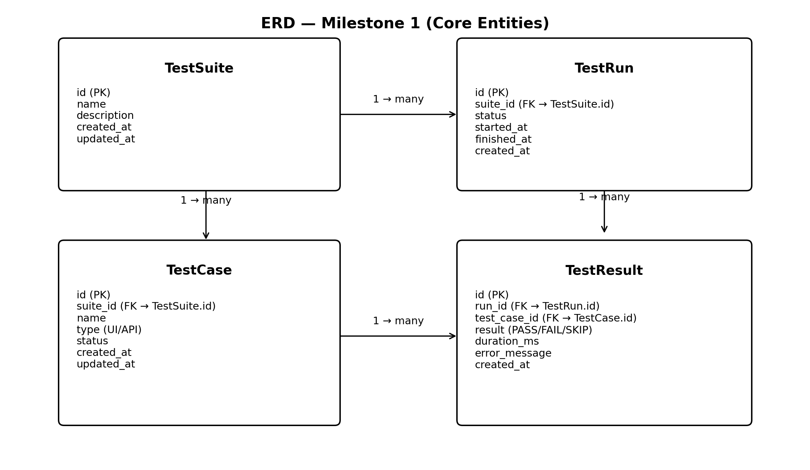

# Data Model - Milestone 1 (Entity Models + DB Foundation) 

**Project:** Automated Regression Test Suite Framework  
**Author:** Akshar Chanchlani  
**Milestone:** 1 (Weeks 1–2)  
**Date:** 26-02-2026

---

## 1. Purpose

This document defines the **core data model** for Milestone 1.  
It supports:
- Storing test definitions (test cases + suites)
- Storing execution information (test runs + results)
- Preparing the foundation for future modules (execution engine, reporting, analytics)

> Milestone 1 explicitly requires defining **test entity models** (with annotations). This document maps those entities to database tables.

---

## 2. Database Choice (Milestone 1)

**Selected DB:** <MySQL>  
**Storage Approach:** Relational schema (normalized) to support:
- Clear relationships between suites, cases, runs, results
- Efficient querying for future reporting/analytics

---

## 3. Naming Conventions

- Table names: `snake_case` (e.g., `test_case`)
- Primary keys: `id` (BIGINT auto-increment / serial)
- Foreign keys: `<ref>_id` (e.g., `suite_id`)
- Timestamps: `created_at`, `updated_at`, `started_at`, `finished_at`

---

## 4. Core Entities (Milestone 1)

Milestone 1 entity set (recommended minimum):
1. `TestSuite`
2. `TestCase`
3. `TestRun`
4. `TestResult`

These are enough to demonstrate:
- entity modeling
- relationships
- DB readiness

---

## 5. Entity-to-Table Mapping

### 5.1 `TestSuite` → `test_suite`

**Purpose:** Groups multiple test cases into a suite.

| Column | Type | Constraints | Description |
|-------|------|-------------|-------------|
| id | BIGINT | PK | Unique suite ID |
| name | VARCHAR(150) | NOT NULL, UNIQUE | Suite name |
| description | TEXT | NULL | Suite description |
| created_at | TIMESTAMP | NOT NULL | Created time |
| updated_at | TIMESTAMP | NOT NULL | Last updated time |

---

### 5.2 `TestCase` → `test_case`

**Purpose:** Represents a single test case definition.

| Column | Type | Constraints | Description |
|-------|------|-------------|-------------|
| id | BIGINT | PK | Unique test case ID |
| suite_id | BIGINT | FK → test_suite.id | The suite this test belongs to |
| name | VARCHAR(200) | NOT NULL | Test case name |
| type | VARCHAR(20) | NOT NULL | UI / API (can be enum later) |
| status | VARCHAR(20) | NOT NULL | ACTIVE / DISABLED |
| priority | VARCHAR(20) | NULL | LOW/MEDIUM/HIGH (optional) |
| created_at | TIMESTAMP | NOT NULL | Created time |
| updated_at | TIMESTAMP | NOT NULL | Last updated time |

**Notes:**
- `type` helps separate UI and API tests for future integration logic.
- `status` allows disabling tests without deletion.

---

### 5.3 `TestRun` → `test_run`

**Purpose:** Represents one execution instance (usually of a suite).

| Column | Type | Constraints | Description |
|-------|------|-------------|-------------|
| id | BIGINT | PK | Unique run ID |
| suite_id | BIGINT | FK → test_suite.id | Which suite was executed |
| run_name | VARCHAR(200) | NULL | Optional label (e.g., “nightly-run”) |
| triggered_by | VARCHAR(100) | NULL | User/CI identifier |
| status | VARCHAR(20) | NOT NULL | QUEUED/RUNNING/COMPLETED/FAILED |
| started_at | TIMESTAMP | NULL | Execution start time |
| finished_at | TIMESTAMP | NULL | Execution end time |
| created_at | TIMESTAMP | NOT NULL | Created time |

**Notes:**
- We keep timing fields for future reporting and analytics.
- Scheduling and parallel execution are NOT implemented in Milestone 1, but the data model supports them.

---

### 5.4 `TestResult` → `test_result`

**Purpose:** Stores the outcome of each test case executed within a run.

| Column | Type | Constraints | Description |
|-------|------|-------------|-------------|
| id | BIGINT | PK | Unique result ID |
| run_id | BIGINT | FK → test_run.id | Which run this result belongs to |
| test_case_id | BIGINT | FK → test_case.id | Which test case produced this result |
| result | VARCHAR(10) | NOT NULL | PASS / FAIL / SKIP |
| duration_ms | BIGINT | NULL | Time taken for the test |
| error_message | TEXT | NULL | Failure reason (if fail) |
| created_at | TIMESTAMP | NOT NULL | Time recorded |

**Optional (future-ready but still safe in Milestone 1):**
| Column | Type | Constraints | Description |
|-------|------|-------------|-------------|
| screenshot_path | TEXT | NULL | Path/URL for screenshot |
| log_path | TEXT | NULL | Path/URL for logs |

---

## 6. Relationships (Cardinality)

- **TestSuite (1) → (Many) TestCase**
    - One suite contains multiple test cases
    - `test_case.suite_id` references `test_suite.id`

- **TestSuite (1) → (Many) TestRun**
    - A suite can be executed many times
    - `test_run.suite_id` references `test_suite.id`

- **TestRun (1) → (Many) TestResult**
    - One run produces many results
    - `test_result.run_id` references `test_run.id`

- **TestCase (1) → (Many) TestResult**
    - A single test case can produce results across multiple runs
    - `test_result.test_case_id` references `test_case.id`

---

## 7. Indexing Strategy (Milestone 1)

Recommended indexes for performance:

- `test_case(suite_id)`
- `test_run(suite_id, started_at)`
- `test_result(run_id)`
- `test_result(test_case_id)`
- (optional) `test_result(result)` for quick PASS/FAIL counts

---

## 8. Data Integrity Rules

- `suite_id` in `test_case` must exist in `test_suite`
- `suite_id` in `test_run` must exist in `test_suite`
- `run_id` in `test_result` must exist in `test_run`
- `test_case_id` in `test_result` must exist in `test_case`

Suggested delete rules (decide with mentor):
- If a suite is deleted → restrict delete or cascade carefully
- Usually better: soft-delete (status flags) rather than hard deletion

---

## 9. Mapping to Java Entity Models (Milestone 1)

Each table corresponds to a Java entity class:
- `TestSuite` → `test_suite`
- `TestCase` → `test_case`
- `TestRun` → `test_run`
- `TestResult` → `test_result`

Entity models will be defined **with annotations** (e.g., `@Entity`, `@Table`, `@Id`, `@ManyToOne`, `@OneToMany`) to match this schema.

---

## 10. Out of Scope for Milestone 1 (Data Model Enhancements)

These are intentionally not required now and can be added later:
- Run parameters table (browser/env/version)
- Step-level logging table
- Report metadata table
- Attachments/artifacts table (for multiple screenshots/logs)
- Analytics aggregation tables

---

## 11. Milestone 1 Deliverable Summary

Milestone 1 data model deliverables:
- Core entities defined (Suite, Case, Run, Result)
- Relationships documented
- Schema prepared for DB initialization
- Ready to implement repositories/APIs in later milestones